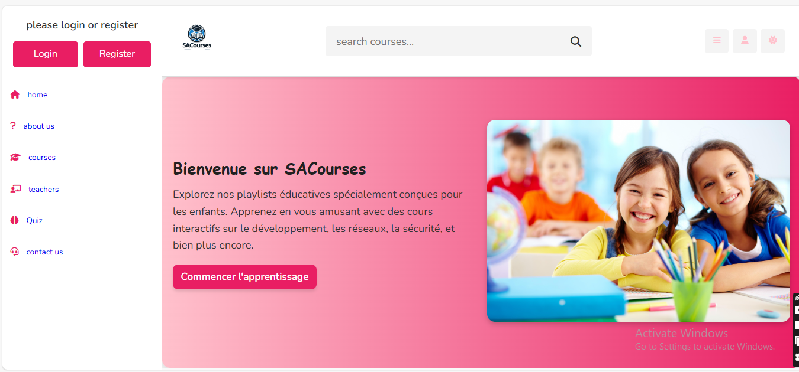
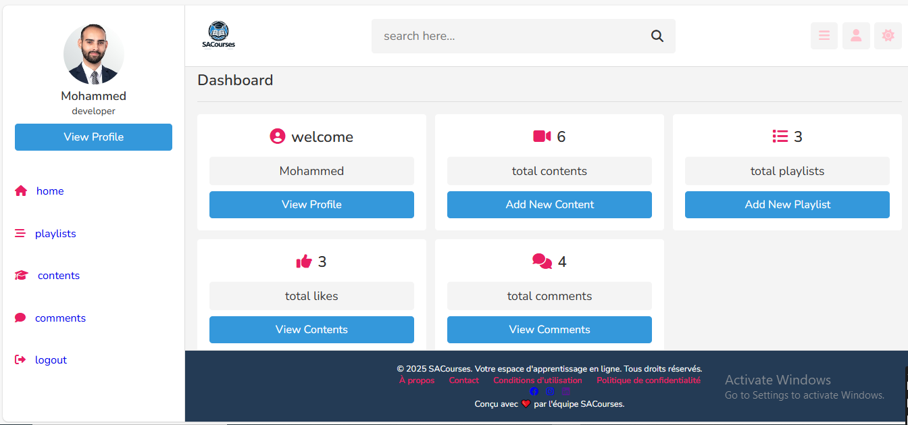
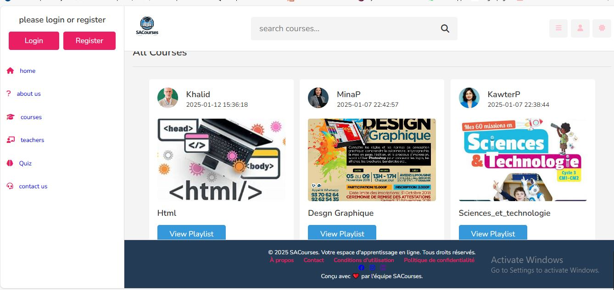
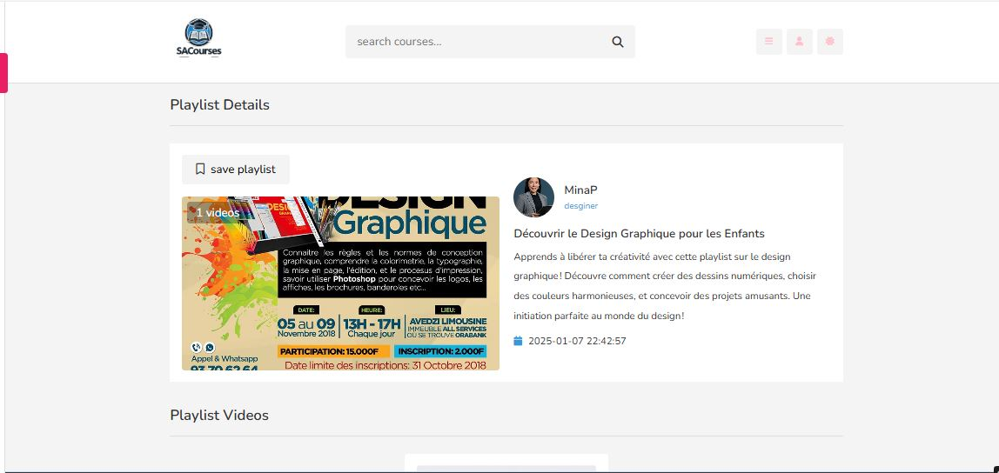
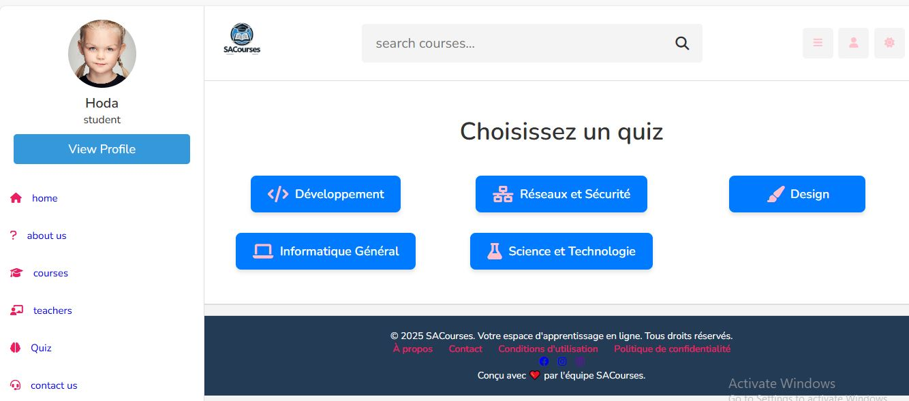
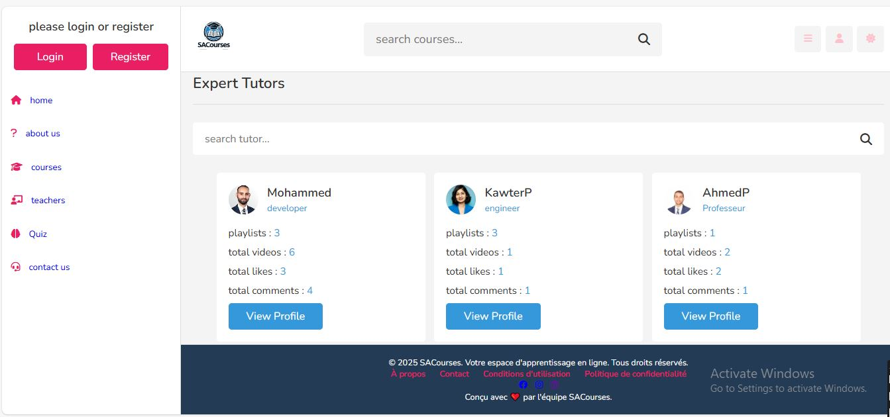

# 🎓 SACourses – Plateforme E-Learning



### 📖 À propos du projet

Le développement de cette plateforme **e-learning destinée aux enfants** a été conçu pour répondre aux besoins croissants d'une éducation numérique interactive, particulièrement adaptée aux jeunes apprenants. L'objectif du projet est de créer un environnement d'apprentissage en ligne ludique et accessible, facilitant l'accès à différents cours et contenus éducatifs.

La plateforme vise à offrir aux enfants une expérience d'apprentissage enrichissante et interactive, tout en permettant aux enseignants de créer, gérer et partager leurs contenus pédagogiques de manière simple et efficace.

### 👨‍🏫 Espace Enseignant

La plateforme permet aux enseignants de :

* Créer et gérer des contenus éducatifs ;
* Ajouter et organiser des vidéos pédagogiques ;
* Créer et gérer des playlists ;
* Ajouter des quiz pour évaluer les connaissances des étudiants ;
* Gérer leur profil utilisateur ;
* Partager des ressources pédagogiques avec les étudiants.

### 👨‍🎓 Espace Étudiant

Les étudiants peuvent :

* Accéder aux vidéos et contenus pédagogiques ;
* Consulter les différentes playlists ;
* Interagir avec les contenus à travers les commentaires et les likes ;
* Participer à des quiz interactifs ;
* Enregistrer leurs playlists préférées ;
* Gérer et personnaliser leur profil utilisateur.

## 🛠️ Technologies utilisées

Le développement de la plateforme a été réalisé à l'aide de plusieurs technologies et outils :

* **HTML5** – Structure des pages web ;
* **CSS3** – Mise en forme et design de l'interface ;
* **JavaScript** – Interactivité et fonctionnalités dynamiques ;
* **PHP** – Développement de la partie serveur et logique métier ;
* **SQL / MySQL** – Gestion et stockage des données ;
* **XAMPP** – Environnement de développement local et serveur Apache ;
* **Visual Studio Code** – Édition et développement du code.

L'utilisation de ces technologies a permis de développer une interface interactive ainsi qu'un système de gestion de contenu adapté aux besoins des utilisateurs.

## 🔄 Méthodologie de développement

Le projet a été réalisé selon une approche de développement **agile**, avec une organisation du travail en plusieurs phases :

1. **Analyse et définition des besoins** ;
2. **Conception de la plateforme** ;
3. **Développement des fonctionnalités** ;
4. **Intégration des différents modules** ;
5. **Tests et validation** ;
6. **Amélioration et optimisation de la plateforme**.

Chaque fonctionnalité a été testée afin de garantir une interaction fluide entre les différents utilisateurs, notamment les enseignants et les étudiants.

## ✨ Fonctionnalités principales

Parmi les principales fonctionnalités de la plateforme :

* 🎥 Ajout et gestion de contenus multimédias ;
* 📚 Création et gestion des playlists ;
* 📝 Création et participation aux quiz ;
* 💬 Commentaires sur les contenus ;
* 👍 Système de likes ;
* 🔖 Enregistrement des playlists ;
* 👤 Gestion et personnalisation des profils utilisateurs ;
* 👨‍🏫 Espace dédié aux enseignants ;
* 👨‍🎓 Espace dédié aux étudiants.

## 🎯 Conclusion

Ce projet a permis de concevoir une solution **e-learning adaptée aux enfants**, offrant une expérience d'apprentissage interactive, accessible et ludique. La plateforme facilite la diffusion des contenus pédagogiques tout en favorisant l'interaction entre les étudiants et les ressources éducatives.

Le projet constitue une base évolutive pouvant être enrichie à l'avenir par de nouvelles fonctionnalités et une diversification des contenus pédagogiques.


## 📂 Structure du projet

```text
SACourses/
│
├── admin/              # Interface d'administration
├── components/         # Composants réutilisables
├── css/                # Fichiers CSS
├── image/              # Images et vidéos
├── images/             # Ressources graphiques
├── js/                 # Scripts JavaScript
├── plateforme/         # Fonctionnalités principales
├── quiz/               # Module des quiz
├── uploads/            # Fichiers téléchargés
│
├── screenshots/        # Captures d'écran
├── README.md           # Documentation du projet

```

---

## ⚙️ Installation

### 1. Cloner le projet

```bash
git clone https://github.com/saadia-achaka/SACourses.git
```

### 2. Placer le projet dans XAMPP

Copier le dossier `SACourses` dans :

```text
C:\xampp\htdocs\
```

### 3. Démarrer XAMPP

Lancer :

* Apache
* MySQL

### 4. Configurer la base de données

Ouvrir :

```text
http://localhost/phpmyadmin
```

Créer une base de données pour le projet et importer le fichier SQL de la base de données.

> Si aucun fichier SQL n'est encore présent dans le projet, il est recommandé d'ajouter un fichier `database.sql` à la racine du projet.

### 5. Configurer la connexion à la base de données

Modifier les paramètres de connexion à la base de données selon votre configuration locale.


```

---

## 📸 Captures d'écran

### 🏠 Page d'accueil



### 📚 Page des cours



### 🎥 Cours vidéo



### 📝 Quiz



### 👨‍💼 Dashboard Administrateur



---

---

## 👩‍💻 Auteur

**Saadia Achaka**

🎓 Master en Informatique et Télécommunications – Génie Logiciel

🔗 GitHub : https://github.com/saadia-achaka

---

## 📄 Licence

Ce projet est développé dans un cadre académique et personnel.
